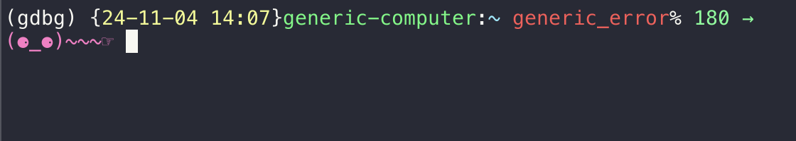

# gdbg  


## overview

> gdbg: *get dexcom blood glucose*

a python service that displays retrieves blood glucose from dexcom via the [pydexcom](https://github.com/gagebenne/pydexcom) library and writes it (and other info) to state file. the state file can then be used for displaying data in your terminal (or anything else you want).

this app was inspired by [kylebshr/luka-mini](https://github.com/kylebshr/luka-mini/tree/main). this is a *fantastic* app i and would recommend for people who want a seamless app experience. i wanted to be able to access the blood glucose data outside of the app for other uses.



## how to use

1. clone repo

TODO: does it need a py env?

2. install requirements

```sh
pip install -r requirements.txt
```

3. setup credentials

*__this file must be created manually__*

* `~/.dexcom/dexcom_credentials.json`

```json
{
  "username" : "dexcom_username",
  "password": "dexcom_password"
}
```

4. run via terminal or add as a service

```sh
python cgm_service.py
```

## blood glucose state file

this file is generated by the app if set to write state

* `~/.dexcom/bg_status.txt`

format of the status is: `[bg] [delta] [trend arrow] '[reading timestamp]'`

the delta starts at 0 and will show change after second reading is retrieved.

### using in zsh $PROMPT

```sh
# ~/.zshrc

function get_bg() {
    RED='\033[91m'
    GREEN='\033[92m'
    YELLOW='\033[93m'
    END='\033[0m'

    state_file=$(cat $HOME/.dexcom/bg_status.txt)
    value=$(echo "$state_file" | cut -d' ' -f1)
    delta=$(echo "$state_file" | cut -d' ' -f2)
    arrow=$(echo "$state_file" | cut -d' ' -f3)

    if [[ $value -ge 80 && $value -le 180 ]]; then
        color="$GREEN"
    elif [[ $value -gt 180 ]]; then
        color="$YELLOW"
    elif [[ $value -lt 80 ]]; then
        color="$RED"
    fi

    echo "${color}${value} (${delta}) ${arrow}${END}"
}

# backslash in `\$(...)` is required for the value to update every time 
export PROMPT="$PROMPT\$(get_bg)"
```
## credits

assets

* logo by [izzy bulling - @izval](https://www.instagram.com/izval/)
* [modak](https://github.com/EkType/Modak) font used in logo

packages

* [gagebenne/pydexacom](https://github.com/gagebenne/pydexcom)


## references

* [kylebshr/luka-mini](https://github.com/kylebshr/luka-mini/tree/main)
(https://camillovisini.com/coding/create-macos-menu-bar-app-pomodoro)
* [Glucose Readings in a Terminal Prompt - Hart Hoover](https://harthoover.com/glucose-readings-in-a-terminal-prompt/)
