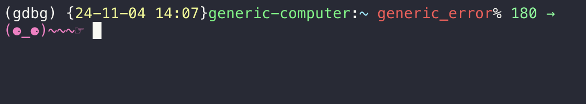

# gdbg  


## overview

> gdbg: *get dexcom blood glucose*

a python app that displays blood glucose in the macos menu bar. retrieves blood glucose from dexcom via the [pydexcom](https://github.com/gagebenne/pydexcom) library. it also writes the blood glucose and trend arrow to a state file that can be used for displaying data in your terminal (or anything else you want).

this app was inspired by [kylebshr/luka-mini](https://github.com/kylebshr/luka-mini/tree/main). this is a __fantastic__ app and would recommend for people who want a seamless app experience. i wanted to be able to access the blood glucose data outside of the app for other uses.




## how to use

### file resources

all resources are in the directory: `$HOME/.dexcom`

#### secrets file

*__this file must be created manually__*

* `dexcom_credentials.json`

```json
{
  "username" : "dexcom_username",
  "password": "dexcom_password"
}
```

#### blood glucose state files

these files are generated by the app

* `bg_status.txt`

### build app

NOTE: using [anaconda](https://docs.anaconda.com/anaconda/install/mac-os/#command-line-install) on macos

```sh
# (1) virtual environment
conda create --name gdbg python=3.11
conda activate gdbg

# (2) install requirements
pip install --no-cache-dir -r requirements.txt

# (3) build app
python setup.py py2app
```

### add to macos login items

TODO: how to

### using in zsh $PROMPT

to use in zsh prompt, update `$PROMPT` in `$HOME/.zshrc`. the backslash when setting `$PROMPT` to execute the function to read the bg text file is __critical__ (will not work otherwise).

```sh
# $HOME/.zshrc

function get_bg() {
    RED='\033[91m'
    GREEN='\033[92m'
    YELLOW='\033[93m'
    END='\033[0m'

    bg_status=$(cat $HOME/.dexcom/bg_status.txt)
    value=$(echo "$bg_status" | cut -d' ' -f1)

    if [[ $value -ge 80 && $value -le 180 ]]; then
        color="$GREEN"
    elif [[ $value -gt 180 ]]; then
        color="$YELLOW"
    elif [[ $value -lt 80 ]]; then
        color="$RED"
    fi

    echo "${color}${bg_status}${END}"
}

export PROMPT="$PROMPT\$(get_bg)"
```

### known issues

TODO: note on if using conda installed from brew (it won't work)

```sh
# TODO: note on this...
# solution if issue with `@rpath/libffi.8.dylib`
ln -sf /opt/homebrew/opt/libffi/lib/libffi.8.dylib /usr/local/lib/

# DEBUG - run built app from terminal to see errors
dist/gdbg.app/Contents/MacOS/gdbg
```

## credits

assets

* logo by [izzy bulling - @izval](https://www.instagram.com/izval/)
* [modak](https://github.com/EkType/Modak) font used in logo

packages

* [gagebenne/pydexacom](https://github.com/gagebenne/pydexcom)
* [jaredks/rumps](https://github.com/jaredks/rumps)
* [dante-biase/py2app](https://github.com/dante-biase/py2app)

## references

* [kylebshr/luka-mini](https://github.com/kylebshr/luka-mini/tree/main)
* [Create a macOS Menu Bar App with Python (Pomodoro Timer) - Camillo Visini](https://camillovisini.com/coding/create-macos-menu-bar-app-pomodoro)
* [Glucose Readings in a Terminal Prompt - Hart Hoover](https://harthoover.com/glucose-readings-in-a-terminal-prompt/)

## TODO:

__(1)__

WARN: WARN: WARN:

`Error setting up client: Can't connect to HTTPS URL because the SSL module is not available.` 

WARN: WARN: WARN:

* [ ] refresh login session id if it fails
  * pydexcom does this here: https://github.com/gagebenne/pydexcom/blob/9bd35b2597513ba6e13ce4e3211a0e8f6517cf33/pydexcom/__init__.py#L341 

__(2)__

* [ ] have final app build to applications dir?
* [ ] have it start as login item

__(3)__

* [ ] linux version
  * [ ] run `dexcom_handler.py` as service
  * [ ] create top bar extension
